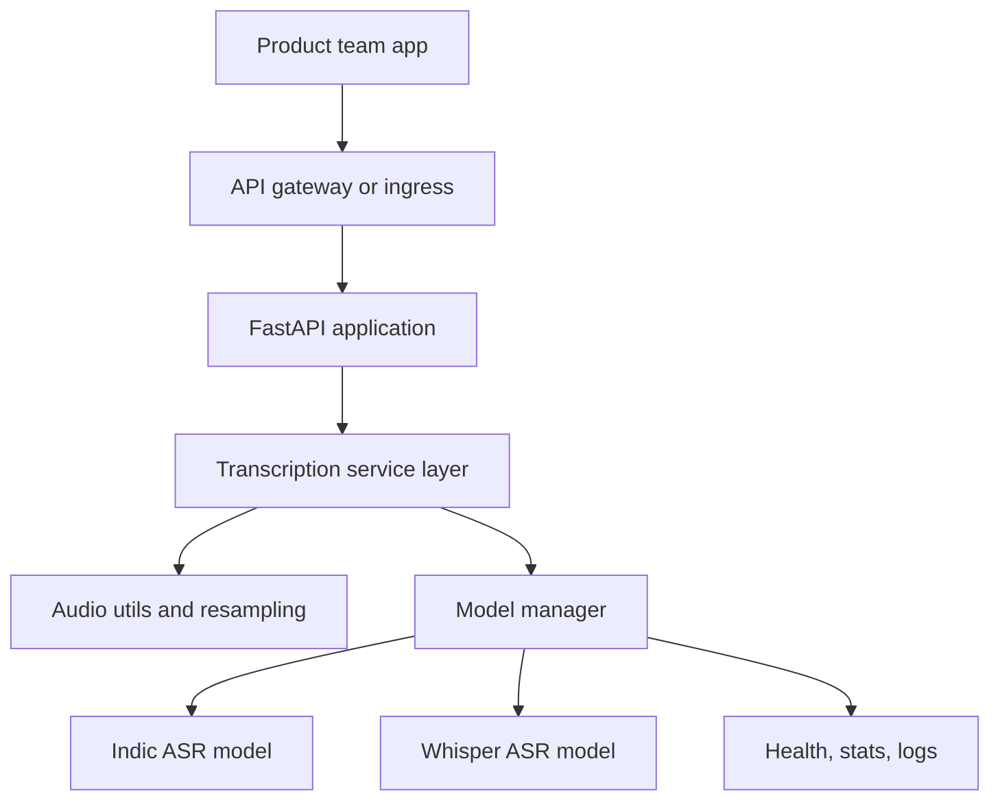
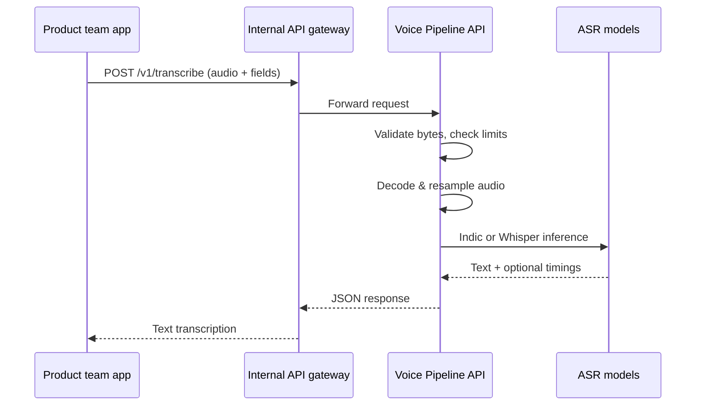

### Voice Pipeline Internal API – Overview

The Voice Pipeline is an internal speech‑to‑text service that any team can call over HTTP. It turns short or long audio recordings into text, with strong support for Indic languages and broad coverage for English and many other languages. This document gives a concise, presentation‑friendly view of what the service does, how it is built, and how to use its API without going into implementation code.

### Why we built this

Many teams need “voice in, text out” capability, but training and operating speech models is expensive and specialised work. The Voice Pipeline centralises that complexity in one place. Product teams send audio to a single internal API and receive high‑quality transcriptions, instead of each team downloading models, managing GPUs, and reinventing the same infrastructure.

### How teams use it

In a typical flow, an application records audio from a user, uploads that file to the Voice Pipeline, and then uses the returned text for search, commands, captions, analytics, or any other product logic. The service hides tasks such as audio validation, resampling, selecting the right model for the requested language, and protecting the underlying hardware from overload. From the caller’s point of view, it behaves like any other synchronous internal HTTP API.

### System architecture at a glance

At a high level, the Voice Pipeline is a stateless FastAPI service that runs inside containers. Traffic usually comes through an internal gateway, reaches the FastAPI routes, flows into a transcription service layer, and is finally handled by one of two model backends: an Indic ASR model for twenty‑two Indian languages, or a Whisper model for English and other languages. A central model manager owns both models in memory, chooses the device (CPU or GPU), and limits how many inferences run at once so latency remains predictable.

Here is a simplified component view:

Each instance is self‑contained: it loads its own models, reads all configuration from environment variables, and does not rely on shared in‑memory state or external model‑serving tiers. This makes it straightforward to scale horizontally by running more replicas behind a load balancer or Kubernetes service.

### Request flow (user journey)

When a team sends audio to the API, the request moves through a predictable end‑to‑end flow. First, the gateway receives the HTTP request and forwards it to the Voice Pipeline. The FastAPI route accepts the uploaded audio file and basic form fields, performs quick validation on the raw bytes, and then hands the work to the transcription service layer.

The transcription layer decodes the audio into a standard waveform, resamples it to the target sample rate, and checks duration and size limits. Once the audio is ready, the service decides whether to use the Indic or Whisper backend based on the requested language. It acquires a slot from a concurrency limiter so that only a safe number of model calls run in parallel, then invokes the appropriate model. The model returns recognised text (and, for Whisper, optional segments and word‑level timings). Finally, the service measures processing time, builds a JSON response with text and metadata, and sends it back through the gateway to the caller.

This end‑to‑end journey can be visualised as:

### Data model: what goes in and what comes out

The main input to the service is a single audio file, plus a small set of form fields that describe what you want. The most important field is the language code, which tells the service which language to expect and, indirectly, which model family to use. For Indic languages, an additional field selects whether you prefer faster decoding or higher accuracy. For Whisper, extra fields enable translation instead of pure transcription, word‑level timestamps, and tuning options for the decoding search.

On success, the response always includes a unique request identifier, the recognised text, the language code and human‑readable language name, information about which model produced the result, the original audio duration, and the total server‑side processing time. For Whisper requests, the response can also carry structured segments and optional per‑word timings so that teams can build richer experiences like synced captions or fine‑grained analytics. In error cases, the API returns clear JSON errors that distinguish between invalid input, configuration problems, and unexpected internal failures.

### API summary and endpoint behaviour

- **Transcription endpoint**
  - **Path**: `POST /v1/transcribe`
  - **Request**:
    - **Body**: multipart form
    - **Fields**:
      - `file`: audio file (single file per request)
      - `language`: language code used for routing and decoding (Indic vs Whisper)
      - `decode_mode`: `ctc` or `rnnt` (Indic only)
      - `task`: `transcribe` or `translate` (Whisper only)
      - `word_timestamps`: boolean flag for per‑word timings (Whisper only)
      - `initial_prompt`: free‑text hint for Whisper decoding
      - `beam_size`: integer beam width for Whisper decoding
  - **Response (success)**:
    - `request_id`: server‑generated correlation ID
    - `text`: final transcription
    - `language`, `language_name`: effective language code and display name
    - `model`: identifier of the backend model used
    - `duration_seconds`: length of input audio
    - `processing_time_ms`: end‑to‑end server processing time
    - `segments`: optional list of time‑aligned segments (Whisper)
    - `word_timestamps`: optional list of word‑level timings (Whisper)
  - **Behaviour**:
    - Synchronous call; client waits for completion
    - Deterministic w.r.t. audio and parameters (no server‑side state)

- **Operational endpoints**
  - **Health**:
    - **Path**: `GET /v1/health`
    - **Payload**: model load flags (Indic, Whisper), device info (CPU/GPU), framework and CUDA versions, startup time, cumulative request and failure counters
    - **Usage**: dashboards, detailed health checks, debugging
  - **Readiness**:
    - **Path**: `GET /v1/ready`
    - **Payload**: minimal JSON plus HTTP status
    - **Semantics**: OK only after models are loaded and any warm‑up has completed
    - **Usage**: load balancers, Kubernetes readiness probes, traffic routing
  - **Liveness**:
    - **Path**: `GET /v1/live`
    - **Payload**: minimal JSON plus HTTP status
    - **Semantics**: indicates that the process is running and responsive
    - **Usage**: Kubernetes liveness probes, restart policy triggers

- **Language metadata endpoints**
  - **List languages**:
    - **Path**: `GET /v1/languages`
    - **Payload**: list of supported language codes with basic metadata
    - **Usage**: configuration, feature flags, UI drop‑downs
  - **Language detail**:
    - **Path**: `GET /v1/languages/{code}`
    - **Payload**: mapping for a single code, including which backend serves it (Indic or Whisper) and the human‑readable display name
    - **Usage**: validating client configuration, showing friendly names, routing logic

### Operating the service

- **Configure the service**
  - **Models**:
    - Set environment variables for the Indic model ID and Whisper model size.
    - Ensure the model cache directory has enough disk space for downloaded weights.
  - **Device and concurrency**:
    - Choose the target device (`cpu`, `cuda`, or `auto`) based on the deployment environment.
    - Set the maximum number of concurrent requests to match available CPU/GPU capacity.
  - **Limits and timeouts**:
    - Define maximum audio duration and upload size to protect the service from oversized inputs.
    - Configure per‑request timeouts to avoid long‑running inferences blocking resources.

- **Deploy and scale**
  - **Container deployment**:
    - Package the service as a container image and run it under your orchestrator (for example, Kubernetes).
    - Mount or configure a persistent volume for the model cache if you want faster restarts.
  - **Readiness and liveness**:
    - Point readiness probes at `/v1/ready` so traffic is sent only after models are fully loaded and warmed up.
    - Point liveness probes at `/v1/live` so stuck or crashed pods are restarted automatically.
  - **Horizontal scaling**:
    - Scale out by increasing the number of replicas behind a service or load balancer.
    - Adjust per‑instance concurrency and replica counts together to balance utilisation and latency.

- **Monitor and operate**
  - **Health checks**:
    - Poll `/v1/health` to confirm that both Indic and Whisper models are loaded and to inspect device status.
    - Use health data to verify that new deployments have initialised correctly.
  - **Metrics and logs**:
    - Track total and failed request counters from the health endpoint over time.
    - Collect structured logs to trace individual requests using the `request_id` field.
  - **Capacity and tuning**:
    - Watch latency, error rates, and resource utilisation to decide when to scale or adjust concurrency.
    - Tune model sizes, decode modes, and timeouts based on observed traffic patterns and SLAs.

